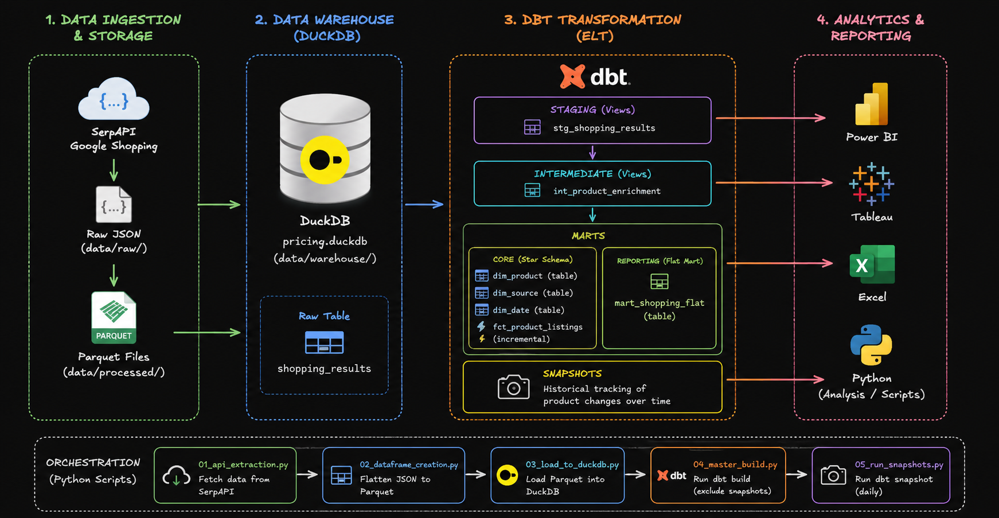

# Electronics Pricing Warehouse

A modern ELT pipeline that extracts Google Shopping data from SerpAPI, stores it in DuckDB, and transforms it using dbt into analytics-ready models.

The project demonstrates a complete data engineering workflow, including data extraction, storage, transformation, testing, incremental models, snapshots, and dimensional modeling.

---

## Architecture

<p align="center">
  
</p>

---

# Features

- Google Shopping extraction using SerpAPI
- JSON → Parquet conversion
- Local analytical warehouse with DuckDB
- ELT transformations using dbt
- Incremental fact models
- dbt snapshots for historical tracking
- Data quality testing using dbt
- Star schema and flat reporting mart
- Python orchestration scripts

---

# Repository Structure

```text
electronics_pricing_warehouse/

├── 01_api_extraction.py
├── 02_dataframe_creation.py
├── 03_load_to_duckdb.py
├── 04_master_build.py
├── 05_run_snapshots.py
│
├── data/
│   ├── raw/
│   ├── processed/
│   └── warehouse/
│       └── pricing.duckdb
│
├── models/
│   ├── staging/
│   ├── intermediate/
│   └── marts/
│
├── snapshots/
├── assets/
│   └── architecture.png
│
├── dbt_project.yml
├── requirements.txt
├── .gitignore
└── README.md
```

---

# Technologies Used

- Python
- Pandas
- DuckDB
- dbt
- SerpAPI

...
